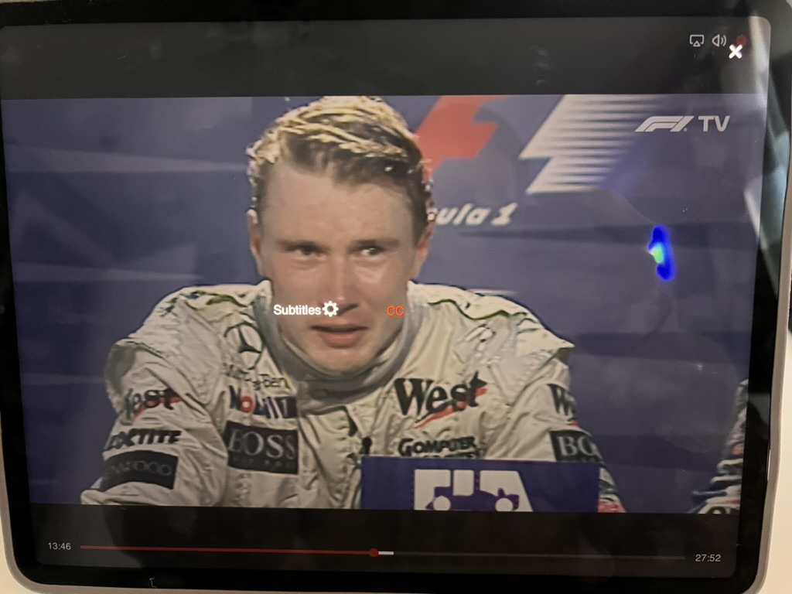
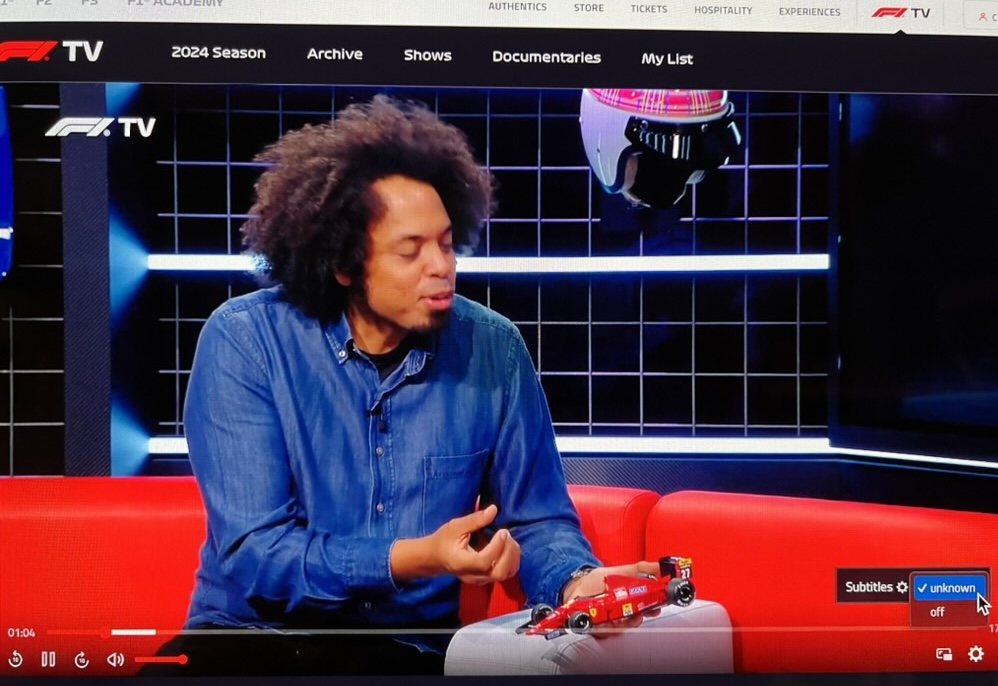
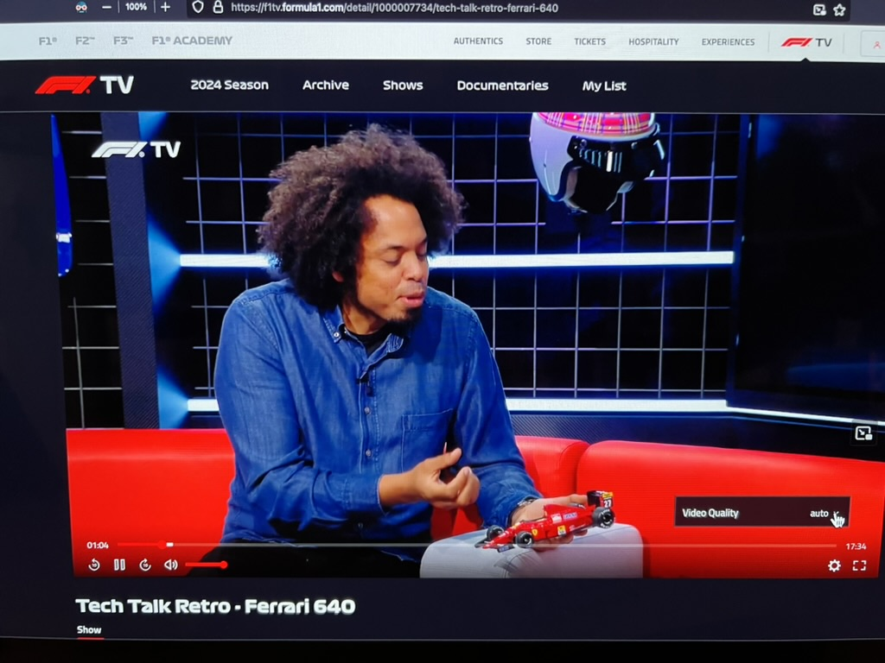
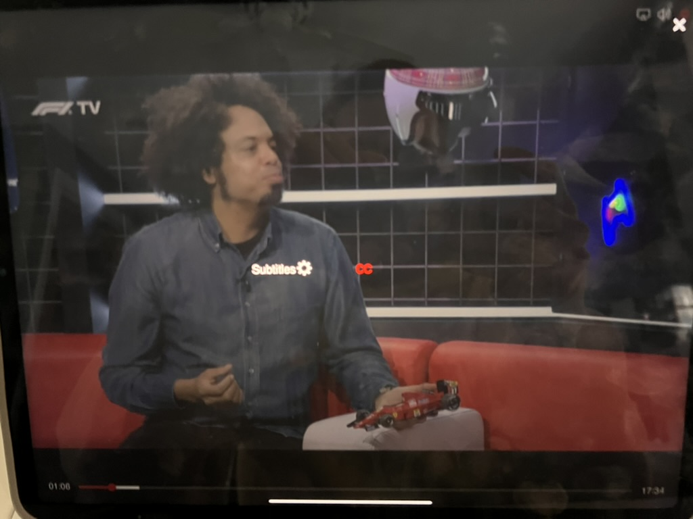
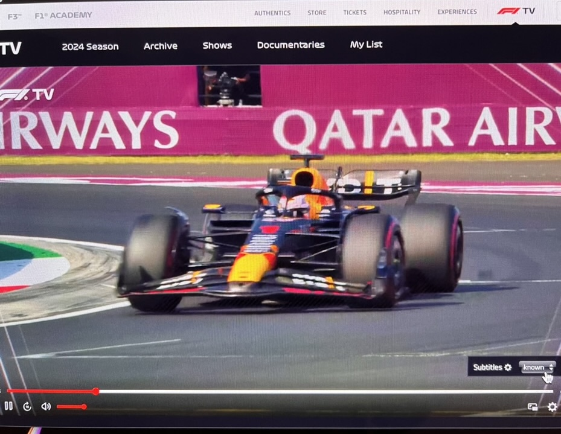
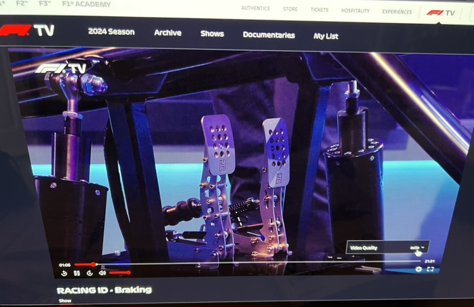
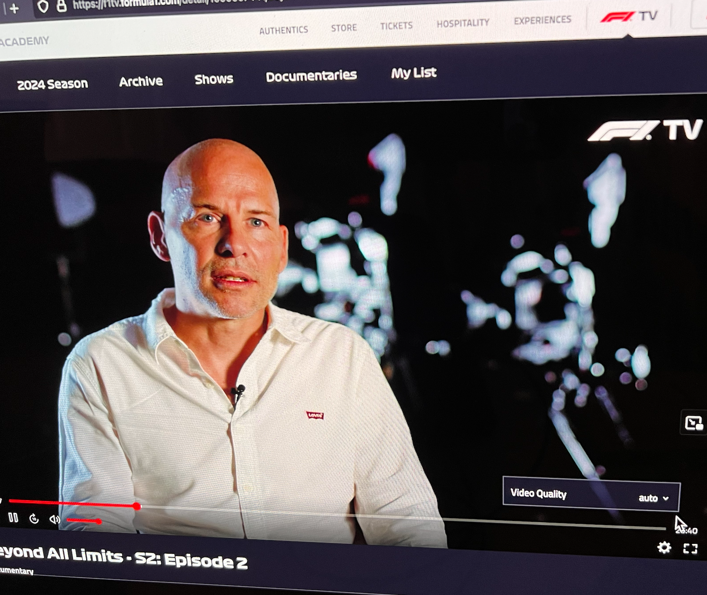
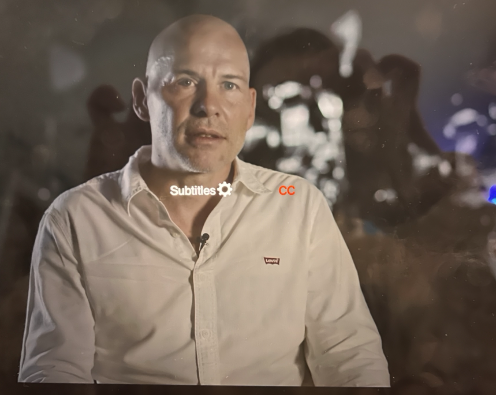

# F1TV SUBTITLE ISSUE DOCUMENTATION

This document provides five examples to highlight the problem with the subtitle system in the F1TV content library across various platforms.

For each example, up to three (3) screenshots are provided:

- Safari browser
- Firefox browser
- F1TV app on iPadOS

## ISSUE DESCRIPTION

### SAFARI BROWSER

Although the subtitles option is available, clicking on it only displays "unknown" for the language. Even after selecting the language, no subtitles appear.

### FIREFOX BROWSER

When viewing the same content on Firefox, there is no subtitle option available. Clicking the gear icon only presents the resolution option.

### F1TV APP ON IPAD

In the F1TV app on iPad, the subtitles option appears as "CC" (Closed Captions), but no subtitles are displayed on the screen.

## EXAMPLES

### EXAMPLE A

- Show: Greatest Comebacks
- Episode: 1 (Mika Häkkinen)

Safari Browser:

Firefox Browser:

iPad + F1TV App:

### EXAMPLE B

- Show: Tech Talk Retro
- Episode: 2 (Ferrari 640)

Safari Browser:

Firefox Browser:

iPad + F1TV App:

### EXAMPLE C

- Show: Racing ID
- Episode: 2 (Cornering)

Safari Browser:

Firefox Browser:

iPad + F1TV App:

### EXAMPLE D

- Show: Jolyon Palmer's Analysis
- Episode: Bahrain Grand Prix

Safari Browser:

Firefox Browser:

iPad + F1TV App:

### EXAMPLE E

- Show: Beyond All Limits
- Episode: S2: Episode 2

Safari Browser:

Firefox Browser:

iPad + F1TV App:

## VIDEO DEMONSTRATION

A video demonstration of the issue on the Safari browser can be found at:
<https://youtu.be/YY1J4VCkWWY>